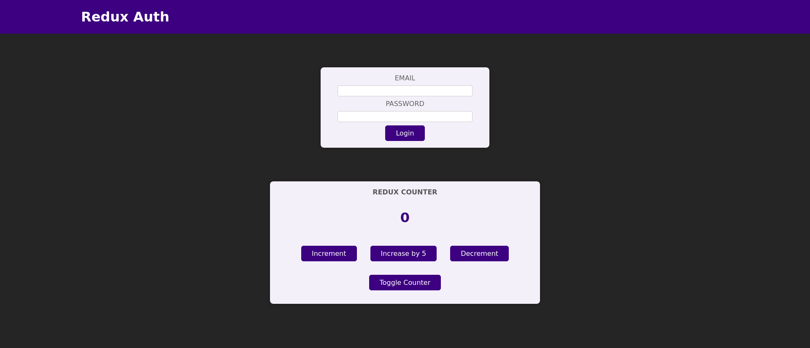
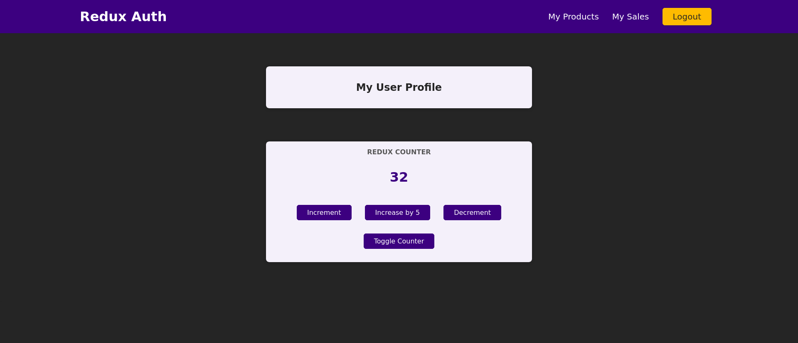
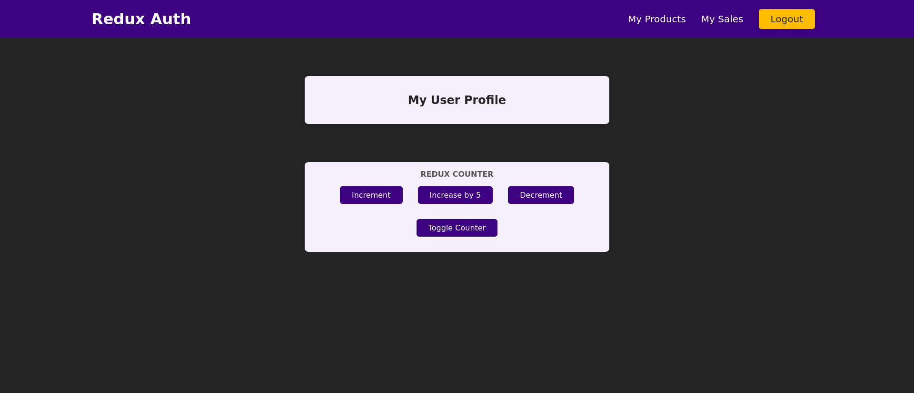

# React Redux Counter

In this application, the following concepts are reflected.

- using redux and redux-toolkit for state management 
- use single data store for redux
- using multiple reducers for state management

### Screen shots

default UI

UI after login.

UI with changing counter

UI with toggle counter

